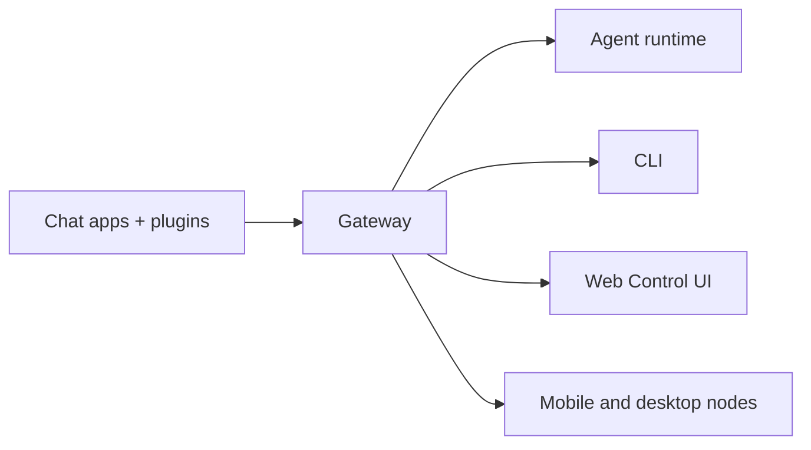

# Vclaw

<p align="center">
  <strong>Local-first multi-agent runtime and gateway across WhatsApp, Telegram, Discord, iMessage, and more.</strong><br />
  Keep durable memory, extensible skills, code execution, and gateway workflows under one Vclaw brand.
</p>

<Columns>
  <Card title="Get Started" href="/start/getting-started" icon="rocket">
    Install Vclaw and bring up the Gateway in minutes.
  </Card>
  <Card title="Run the Wizard" href="/start/wizard" icon="sparkles">
    Guided setup with `vclaw onboard` and pairing flows.
  </Card>
  <Card title="Open the Control UI" href="/web/control-ui" icon="layout-dashboard">
    Launch the browser dashboard for chat, config, and sessions.
  </Card>
</Columns>

## What is Vclaw?

Vclaw is a **local-first multi-agent runtime** with gateway capabilities. It keeps the strong parts of the legacy claw runtime baseline, but presents them under a single Vclaw brand with durable memory, extensible skills, and task execution workflows.

**Who is it for?** Developers and power users who want a personal AI assistant they can message from anywhere without giving up control of their data.

**What makes it different?**

- **Local-first**: runs on your hardware, your rules
- **Multi-channel**: one Gateway serves WhatsApp, Telegram, Discord, and more
- **Agent-native**: built for coding agents with tool use, sessions, memory, and multi-agent routing
- **Compatible**: keeps legacy OpenClaw plugin-sdk and skill ecosystem compatibility where needed

## How it works



The Gateway remains the single source of truth for sessions, routing, and channel connections.

## Quick Start

<Steps>
  <Step title="Install Vclaw">
    ```bash
    npm install -g openclaw@latest
    ```

    The npm package name remains `openclaw` during the compatibility window, but the primary CLI brand is `vclaw`.
  </Step>
  <Step title="Onboard and install the service">
    ```bash
    vclaw onboard --install-daemon
    ```
  </Step>
  <Step title="Pair channels and start the Gateway">
    ```bash
    vclaw channels login
    vclaw gateway --port 18789
    ```
  </Step>
</Steps>

Need the full install and dev setup? See [Quick start](/start/quickstart).

## Configuration

Vclaw currently reads compatibility config from `~/.openclaw/openclaw.json` while the native path migration is still in progress.

- If you do nothing, Vclaw uses the bundled runtime with per-sender sessions.
- If you want to lock it down, start with `allowFrom` rules and explicit mention patterns.

Example:

```json5
{
  channels: {
    whatsapp: {
      allowFrom: ["+15555550123"],
      groups: { "*": { requireMention: true } }
    }
  },
  messages: {
    groupChat: { mentionPatterns: ["@vclaw"] }
  }
}
```

## Start Here

<Columns>
  <Card title="Docs hubs" href="/start/hubs" icon="book-open">
    All docs and guides, organized by use case.
  </Card>
  <Card title="Configuration" href="/gateway/configuration" icon="settings">
    Core Gateway settings, tokens, and provider config.
  </Card>
  <Card title="Remote access" href="/gateway/remote" icon="globe">
    SSH and tailnet access patterns.
  </Card>
  <Card title="Channels" href="/channels/telegram" icon="message-square">
    Channel-specific setup for WhatsApp, Telegram, Discord, and more.
  </Card>
  <Card title="Nodes" href="/nodes" icon="smartphone">
    iOS and Android nodes with pairing, Canvas, camera/screen, and device actions.
  </Card>
  <Card title="Help" href="/help" icon="life-buoy">
    Common fixes and troubleshooting entry point.
  </Card>
</Columns>
