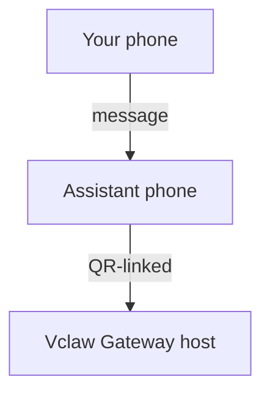

# Building a personal assistant with Vclaw

Vclaw is a local-first assistant runtime and Gateway that can sit behind WhatsApp, Telegram, Discord, and other channels. This guide focuses on one practical shape: a dedicated assistant number that behaves like your always-on personal agent.

<Note>
Current documented workspace release: <strong>2026.3.12</strong>
</Note>

## Safety first

You are putting an agent in a position to:

- run commands on your machine
- read and write files in your workspace
- send messages back out through connected channels

Start conservative:

- always set `channels.whatsapp.allowFrom`
- use a dedicated number for the assistant
- disable heartbeats until you trust the setup with `agents.defaults.heartbeat.every: "0m"`

## Prerequisites

- Vclaw installed and onboarded
- A second phone number for the assistant

## Recommended topology



If you link your personal WhatsApp directly to Vclaw, every incoming message becomes agent input. That is rarely the safest starting point.

## 5-minute quick path

1. Pair WhatsApp Web:

```bash
pnpm vclaw -- channels login
```

2. Start the Gateway:

```bash
pnpm vclaw -- gateway --port 18789
```

3. Put a minimal config in `~/.vclaw/vclaw.json`:

```json5
{
  channels: {
    whatsapp: {
      allowFrom: ["+15555550123"]
    }
  }
}
```

4. Reopen the dashboard whenever needed:

```bash
pnpm vclaw -- dashboard
```

## Workspace

Keep the agent workspace under `~/.vclaw/workspace`. Put `AGENTS.md`, `SOUL.md`, `TOOLS.md`, `IDENTITY.md`, `USER.md`, `HEARTBEAT.md`, and `MEMORY.md` there, and treat that folder as the long-lived operating surface for your assistant.

```bash
pnpm vclaw -- setup
```

Tip: make the workspace a private git repo so your operating instructions and memory files stay versioned.

## A practical assistant config

```json5
{
  logging: { level: "info" },
  agent: {
    model: "anthropic/claude-opus-4-6",
    workspace: "~/.vclaw/workspace",
    thinkingDefault: "high",
    timeoutSeconds: 1800,
    heartbeat: { every: "0m" }
  },
  channels: {
    whatsapp: {
      allowFrom: ["+15555550123"],
      groups: {
        "*": { requireMention: true }
      }
    }
  },
  routing: {
    groupChat: {
      mentionPatterns: ["@vclaw", "vclaw"]
    }
  }
}
```

## Sessions and heartbeats

- Keep sessions beside the runtime home and workspace.
- Use `/new` or `/reset` when you want a fresh conversation boundary.
- Enable heartbeats only after the assistant is behaving the way you expect.

## Operator checklist

```bash
pnpm vclaw -- status
pnpm vclaw -- status --all
pnpm vclaw -- status --deep
pnpm vclaw -- health --json
```

## Next steps

- [Gateway runbook](/gateway)
- [Cron jobs](/automation/cron-jobs)
- [macOS app](/platforms/macos)
- [iOS app](/platforms/ios)
- [Android app](/platforms/android)
- [Security](/gateway/security)
